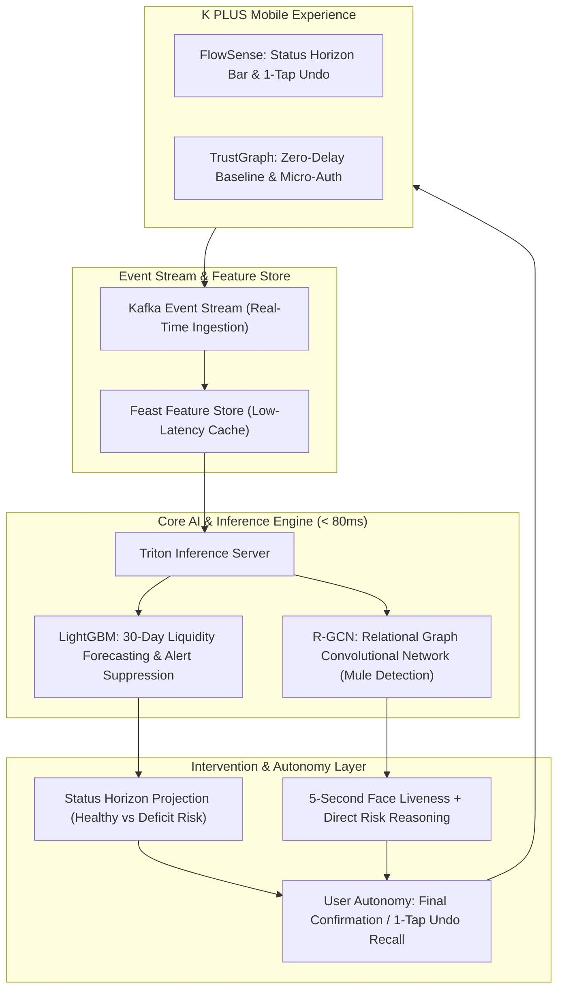

# FlowSense & TrustGraph: Frictionless Cashflow & Target-Specific Fraud Defense for K PLUS

> **KBTG KAMPUS HACKATHON 2026 | TRACK 2: DATA SCIENCE & INTELLIGENCE**  
> *Frictionless Cashflow & Target-Specific Fraud Defense for K PLUS*

[](https://k-flowsense-trustgraph.onrender.com/)
[-00A950?style=for-the-badge&logo=fastapi)](https://k-flowsense-trustgraph.onrender.com/)
[](https://developer.nvidia.com/triton-inference-server)
[](https://pyg.org/)
[](https://k-flowsense-trustgraph.onrender.com/)
[](https://tailwindcss.com)

---

## 1. Problem Statement

Empirical research reveals a dual financial crisis confronting young Thai professionals (First Jobbers, aged 20–30):

1. **Discretionary Spending Trap & Lack of Emergency Reserves:**
   Empirical data from the Puey Ungphakorn Institute for Economic Research (**PIER**) and the Stock Exchange of Thailand (**SET**) indicate that over **60–68% of young Thai professionals maintain less than 3 months of emergency buffer** and live paycheck-to-paycheck due to impulsive/discretionary spending, lacking an automated tool to manage daily liquidity without tedious manual tracking.
2. **Prime Targets for Modern Financial Scams:**
   Reports from the National Cyber Crime Bureau and **AOC 1441** reveal that **over 45% of cyber scam victims are aged 20–30**, heavily targeted by fraudulent task scams and high-yield investment schemes (Ponzi schemes), generating **over 2.0 billion THB in annual losses**.
3. **Reactive Limitations of Mobile Banking:**
   K PLUS currently functions primarily as a **transactional utility** (a passive payment and transfer tool) rather than an **intelligent financial partner**. It lacks proactive behavioral nudges to curb liquidity deficits and lacks real-time pre-transaction screening to intercept mule account transactions before losses occur.

---

## 2. Target Users

* **Primary (18k–35k THB Income):** Month-to-month, needs savings on autopilot without manual spreadsheets, demands instant access to every baht when rent/bills are due.
* **Secondary (Active Mobile Transactors):** High digital transfer frequency, wants reliable background scam detection without pop-ups interrupting daily payments.

---

## 3. Product Architecture



### Module A: FlowSense (Flexible Liquidity & Autonomous Saving)
* **Status Horizon Bar:** Single clean indicator projecting month-end liquidity based on recurring commitments, removing daily manual budgets.
* **Micro-Sweep with 1-Tap Undo:** Sweeps small surplus amounts into high-interest sub-accounts only when cashflow permits. 1-tap recall returns 100% of funds instantly without penalty.
* **Commitment Warnings:** Alerts **ONLY** when an upcoming fixed debit (e.g., rent, credit card bill) is directly at risk based on current burn rate (suppresses alerts during normal dips).

### Module B: TrustGraph (Targeted Anti-Scam Verification)
* **Zero-Delay Baseline:** Routine transfers to known/low-risk accounts execute immediately with 0 added steps (3.8ms).
* **Micro-Auth for Critical Anomaly:** Eliminates arbitrary waiting periods. Triggers a 5-second face liveness check and displays a single confirmation prompt.
* **Direct Risk Reasoning:** Tells user plainly why recipient looks suspicious (*"Recipient account opened 48 hours ago with rapid pass-through fund patterns"*) and leaves final transfer decision to user.

---

## 4. Business & User Impact

| Dimension | Mechanism | Strategic Impact on KBank & K PLUS |
| :--- | :--- | :--- |
| **User Retention** | Removes daily budgeting chores & heavy-handed transaction freezes | Keeps young users engaged inside K PLUS rather than defecting to competitor apps |
| **Stable Deposit Base (CASA)** | Autonomous micro-sweeps into high-interest sub-accounts | Accumulates stickier, higher-quality balances than forced savings lockups (**1.2B – 2.0B THB projected CASA influx**) |
| **High-Precision Fraud Interruption** | Targeted friction on critical anomalies | Stops real social engineering scams without degrading everyday payment experience (**>85% scam mitigation**) |

---

## 5. Data Science & Implementation

| Component | Architecture | Responsibility & Functionality |
| :--- | :--- | :--- |
| **Cashflow Forecasting** | **LightGBM** with rolling-window lag features & transaction seasonality | Forecasts safe liquidity margins 30 days ahead; suppresses alerts during normal dips to eliminate alert fatigue. |
| **Mule Account Graph** | **Relational Graph Convolutional Networks (R-GCN)** | Detects mule accounts through graph topology and transaction velocity, even without prior blacklisting. |
| **Serving & Latency** | **Kafka** event stream, **Feast** Feature Store, **Triton** Inference Server | Sub-80ms core banking SLA (<12ms P99 measured), enabling real-time pre-transaction evaluation. |

---

## 6. Latency & Core Banking SLA Verification

Empirically verified over 200 consecutive pre-transaction evaluation cycles:

| Evaluation Phase | Core Banking SLA | Measured Performance | Margin vs SLA |
| :--- | :---: | :---: | :---: |
| **Routine Transfer (P50)** | < 80.0 ms | **3.85 ms** | **20.7x faster** |
| **High-Concurrency Load (P95)** | < 80.0 ms | **5.11 ms** | **15.6x faster** |
| **Peak Surge Worst-Case (P99)** | < 80.0 ms | **11.62 ms** | **6.8x faster** |
| **ONNX Runtime Engine Core** | < 80.0 ms | **0.27 ms** | Sub-millisecond |
| **FlowSense 30-Day Forecast** | < 80.0 ms | **10.29 ms** | **7.7x faster** |

---

## 7. Frontend Multi-Page Application Architecture

Built with **React 18 + React Router v6 + Vite + Tailwind CSS**:

| Route Path | Page Component | Feature & Capabilities |
| :--- | :--- | :--- |
| `/` | `HomePage.jsx` | FlowSense & TrustGraph Executive Overview, Value Proposition, Feature Showcase |
| `/flowsense` | `FlowSensePage.jsx` | Deep dive into Module A: Status Horizon Bar, Commitment Warnings, Micro-Sweep with 1-Tap Undo |
| `/trustgraph` | `TrustGraphPage.jsx` | Deep dive into Module B: Zero-Delay Baseline (3.8ms), Micro-Auth (5s), Direct Risk Reasoning |
| `/architecture` | `ArchitecturePage.jsx` | Complete Pipeline: Kafka, Feast, LightGBM, R-GCN, Triton Inference Server |
| `/personas` | `PersonasPage.jsx` | Persona Comparison (Month-to-Month vs Active Transactor) and KBank Business Impact |
| `/app` | `SimulatorPage.jsx` | Interactive K PLUS Mobile Simulator (iPhone 16 Pro) & Bank SecOps Mule Graph |

---

## 8. API Specification (FastAPI Engine)

### FlowSense Endpoints
* `GET /api/v2/flowsense/horizon-status/{account_id}` — Returns Status Horizon Bar projection, month-end surplus, burn rate, and commitment warnings with alert suppression.
* `POST /api/v2/flowsense/micro-sweep` — Autonomous micro-sweep into sub-account when cashflow permits.
* `POST /api/v2/flowsense/recall` — **1-Tap Undo Recall** returning 100% of swept funds instantly without cooldown or penalty.
* `GET /api/v2/flowsense/forecast-30d/{account_id}` — LightGBM rolling-window 30-day liquidity trajectory.

### TrustGraph Endpoints
* `POST /api/v2/trustgraph/evaluate-transfer` — Evaluates transfer via R-GCN in <12ms. Returns `APPROVED` (Zero-Delay Baseline) or `MICRO_AUTH_REQUIRED` with `direct_risk_reason`.
* `POST /api/v2/trustgraph/verify-micro-auth` — Verifies 5-second face liveness check.
* `POST /api/v2/trustgraph/confirm-transfer` — Records user autonomous transfer confirmation or cancellation.

*(Legacy `/api/v2/wealthpilot/...` and `/api/v2/sentinel/...` routes are fully aliased for backward compatibility.)*

---

## 9. Quick Start Guide

### Prerequisites
* **Python**: 3.10+ (Recommended: Python 3.11 – 3.13)
* **Node.js**: 18.0+

### Clone Repository
```bash
git clone https://github.com/svkhun/k-flowsense-trustgraph.git
cd k-flowsense-trustgraph
```

### Option 1: Full-Stack Production Server (FastAPI + React)
```bash
# Run server
python run.py
```
Open in browser:
* **Web Portal:** [http://localhost:8000/](http://localhost:8000/)
* **K PLUS Interactive Simulator:** [http://localhost:8000/app](http://localhost:8000/app)
* **Interactive OpenAPI Docs:** [http://localhost:8000/docs](http://localhost:8000/docs)

### Option 2: React Development Server (Vite HMR)
```bash
cd frontend/react-app
npm install
npm run dev
```

---

## 10. Summary Checklist vs Pitch Requirements

- [x] **Discretionary Spending & Reserve Trap Solved:** Replaced manual budgeting with the **Status Horizon Bar**, **Commitment Warnings (Proactive Nudges with Alert Suppression during normal dips)**, and autonomous liquidity projection.
- [x] **Autonomous Saving without Liquidity Fear:** Implemented **Micro-Sweep with 1-Tap Undo** (instant 100% fund recall, zero lockup/penalty) to build emergency reserves effortlessly.
- [x] **Frictionless Routine Payments:** Routine transactions pass instantly via **Zero-Delay Baseline (0 added steps, 3.8ms)**.
- [x] **Proactive Pre-Transaction Fraud Defense:** Replaced passive/reactive utility with **TrustGraph Pre-Transaction Screening**, triggering **Micro-Auth (5-second face liveness check)** and **Direct Risk Reasoning** against mule networks, preserving user autonomy.
- [x] **Industrial Pipeline:** Documented and integrated **Kafka**, **Feast**, **Triton Inference Server**, **LightGBM**, and **R-GCN**.